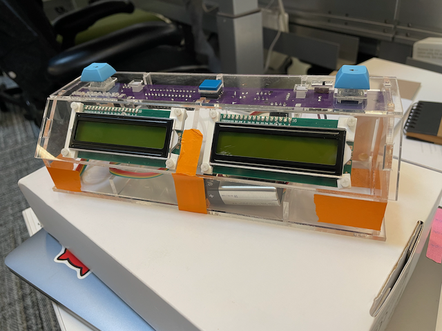

# Gravity chess clock

The Gravity project is an open-source digital chess clock made of parts accessible for DIY tinkerers with relatively limited experience: for Gravity v1, we believe that the project should be accessible to anyone who's confident soldering through-hole components to a circuitboard.

Gravity v1 (the latest version) is based off of the processor from an Arduino Uno board (ATMega328). [See a full list of materials for Gravity v1][#bill-of-materials].

## How to use the clock

The clock has three buttons: the two “pass turn” buttons on either side, and the “reset” button in the center. For simplicity, we’ll refer to them as the left, center, and right buttons.

### Selecting settings

When you first turn on the clock, you’ll be in settings selection mode. In this mode, you can use the center button to cycle through settings. If you like the current settings, you can [start a game](#starting-a-game), and if none of the settings match what you want, you can [edit settings](#editing-settings).

Here’s an example of the settings display that you’ll see.

- the amount of total time for each player (the `00h05m00s` on the left)
- the per-turn increment for each player (the `+00s` on the right)
- whether the clock will make noise on particular events:
  - when a player flags (runs out of time): ` -f` for no sound, `+f` for sound
  - when a player passes their turn: ` -t` for no sound, `+t` for sound

As a second example, here’s a 5-minute-per-side with a 3 second increment each turn, set to audibly notify when you change turns and if someone runs out of time:

#### Editing settings

With the settings slot that you want to change on the screen, press and hold the center button for at least a second. When you release it, you should hear a chirp sound, and a cursor line will display under the setting that's ready to change, starting on the left player’s hour setting:

You can increment the number with the right button or decrement it with the left button; when you’re done modifying this number, press the center button to move to the next place.

You cycle through the settings in this order (and don’t worry, you’ll wrap around once you get to the end):

- left player's total time:
  - left player's unit hours (0**0**h)
  - left player's tens of minutes (**0**5m)
  - left player's unit minutes (0**0**m)
  - left player's tens of seconds (**0**0s)
  - left player's unit seconds (0**0**s)
- right player's total time:
  - right player's unit hours (0**0**h)
  - right player's tens of minutes (**0**5m)
  - right player's unit minutes (0**0**m)
  - right player's tens of seconds (**0**0s)
  - right player's unit seconds (0**0**s)
- per-turn increment:
  - tens of seconds (+**0**3s)
  - units of seconds (+0**3**s)
- sounds:
  - toggle sound on flag (**+**f)
  - toggle sound on turn change (**+**t)

If you don't like the settings you've changed and don't want to save them, just turn the clock off and turn it back on again. If you're happy with the settings, hold the center button for 1 second to save them, and another chirp will sound.

### Starting a game

From the "Select Settings" screen, starting a game is easy: hit the left or right button to start the opposing player's clock.

#### Ending a turn

Ending a turn works the same as starting a game: once you've finished your turn, press the button on your side, and the counter will switch to your opponent.

#### Pausing (and resuming) a game

To pause a game, press the center button. To resume, press the left or right button like you did to start the game.

#### Resetting a game

Pause the game by pressing the center button, then press the center button two more times to reset the game.

### Special: toggling backlight

To toggle the backlights on the displays, hold down the center button and tap one of the turn buttons three times.

## How to put the clock together

### Bill of materials
